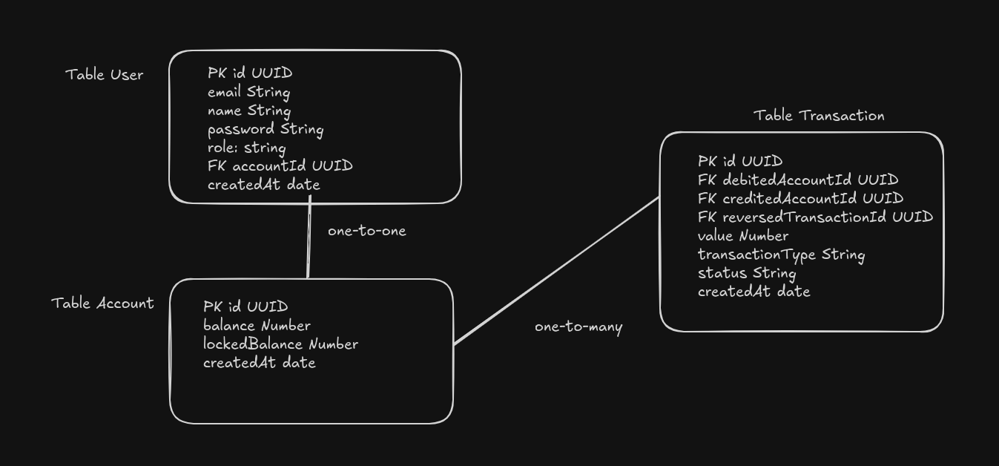

# Aplicação de Carteira Financeira

## Objetivo

O objetivo deste projeto é construir uma carteira financeira onde os usuários possam transferir saldo entre si. Haverá apenas um tipo de usuário, que pode enviar e receber dinheiro de outros usuários dentro do sistema.

---

## Tecnologias

Este projeto foi desenvolvido utilizando o seguinte stack:

- **Node.js**
- **NestJS**
- **TypeScript**

Essas tecnologias fornecem escalabilidade, segurança de tipos e boas práticas modernas para construir aplicações de fácil manutenção.

---

## Estrutura do Projeto

A aplicação consiste nos seguintes componentes principais:

1. **Usuário (User)**: Registra-se no sistema, autentica-se e pode enviar/receber dinheiro.
2. **Conta (Account)**: Armazena o saldo do usuário e controla os saldos bloqueados.
3. **Transação (Transaction)**: Gerencia transferências de dinheiro entre contas, garantindo que cada transferência possa ser revertida em caso de inconsistência ou por solicitação do usuário.

---

## Modelagem do Banco de Dados

O diagrama abaixo representa a modelagem do banco de dados usada na aplicação:


_Figura: Relações entre as tabelas User, Account e Transaction._

- **Tabela User**:

  - `id`: Chave Primária (UUID)
  - `email`: Email do usuário
  - `name`: Nome do usuário
  - `password`: Senha criptografada
  - `role`: Função do usuário (usuário padrão)
  - `accountId`: Chave estrangeira para a tabela Account
  - `createdAt`: Data de criação do usuário

- **Tabela Account**:

  - `id`: Chave Primária (UUID)
  - `balance`: Saldo disponível do usuário
  - `lockedBalance`: Saldo reservado (ex.: para transações pendentes)
  - `createdAt`: Data de criação da conta

- **Tabela Transaction**:

  - `id`: Chave Primária (UUID)
  - `debitedAccountId`: Chave estrangeira para a Conta debitada
  - `creditedAccountId`: Chave estrangeira para a Conta creditada
  - `reversedTransactionId`: Chave estrangeira para a transação sendo revertida (se aplicável)
  - `value`: Valor do dinheiro transferido
  - `transactionType`: Tipo de transação (ex.: transferência, reversão)
  - `status`: Status atual da transação (ex.: pendente, concluída, revertida)
  - `createdAt`: Data de criação da transação

---

## Funcionalidades

1. **Cadastro de Usuário**:

   - Os usuários podem criar uma conta fornecendo nome, email e senha.

2. **Autenticação**:

   - O sistema inclui autenticação, garantindo acesso seguro através de autenticação baseada em token.

3. **Transferência de Saldo**:

   - Os usuários podem enviar e receber dinheiro entre si.
   - Antes de processar uma transferência, o sistema valida se o remetente tem saldo suficiente.
   - As transações são registradas com segurança na tabela `Transaction`.

4. **Reversão de Transação**:

   - Transações podem ser revertidas em caso de inconsistências ou por solicitação do usuário.
   - O processo de reversão garante que a transação original seja referenciada e tratada adequadamente.

---

## Configuração e Execução

1. **Clonar o repositório**:

   ```bash
   git clone <url-do-repositorio>
   cd bank-account
   ```

2. **Instalar dependências**:

   ```bash
   npm install
   ```

3. **Configuração do Ambiente**:
   Crie um arquivo `.env` na raiz do projeto e defina as variáveis de ambiente necessárias, como conexão com o banco de dados e segredo do JWT.
4. **Executar a Aplicação**:
   Para rodar o projeto, é necessário ter o Docker e o Docker Compose instalados na máquina. Em seguida, execute o comando:

   ```bash
   docker compose up
   ```

5. **Verificar as Métricas**
   Acesse http://localhost:9090 para abrir a interface do Prometheus. Você poderá consultar as métricas coletadas em http://localhost:3000/metrics.
   Após a aplicação estar rodando, você pode acessar a documentação da API pelo Swagger em `http://localhost:3000/docs`.

6. **Usuario Admin api**

```
email: "admin@admin.com",
password: "Admin123!"
```

---

## Testes

O projeto inclui:

- **Testes Unitários** para componentes individuais.
- **Testes de Integração** para validar o comportamento geral do sistema.

Execute os testes com:

```bash
npm run test
```
